- 查看数据类型

```python
money = 10
tymo=type(money)
print(type(tymo))
```

- `tymo`是`type`类型(惊🤯)


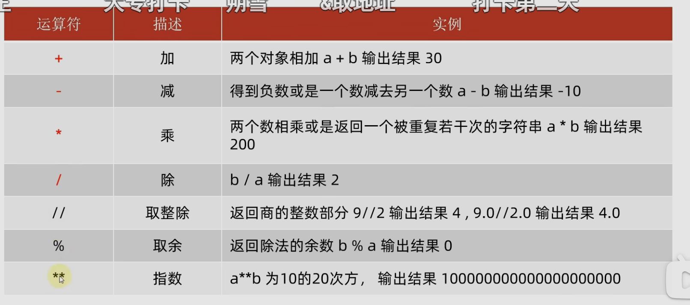

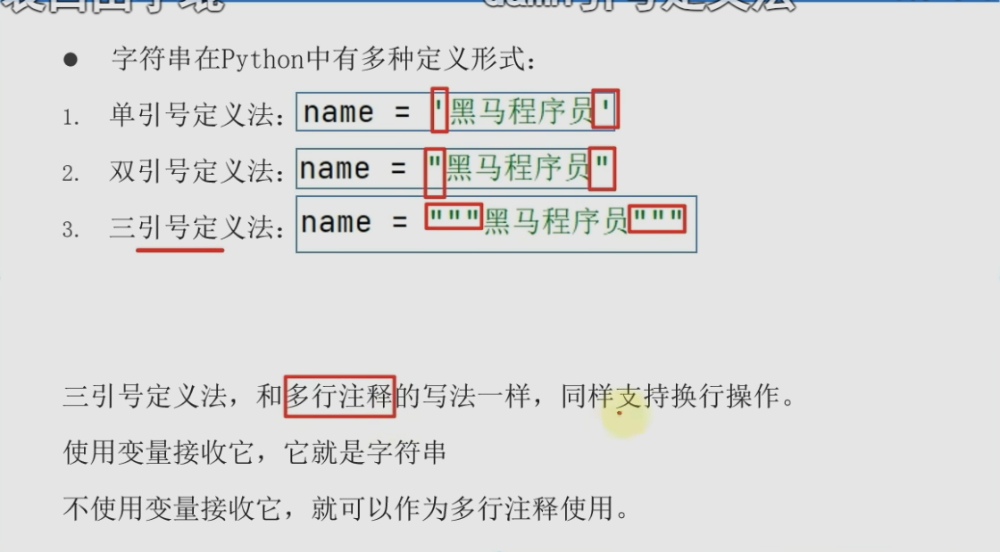

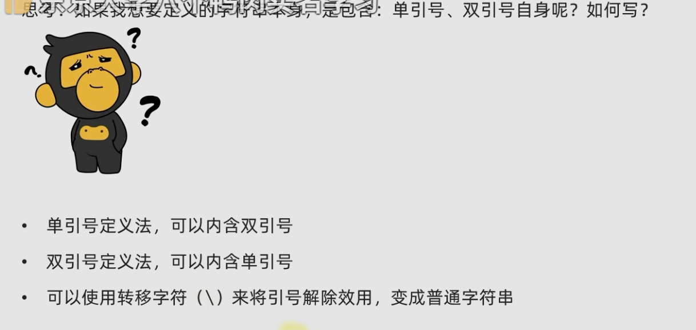

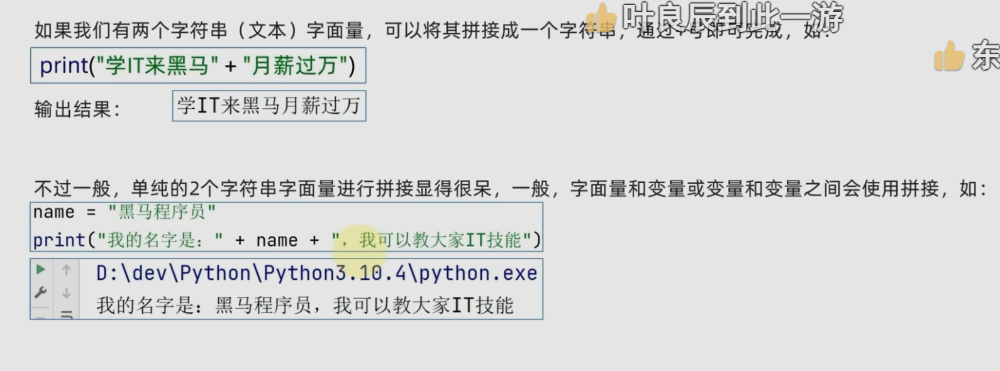

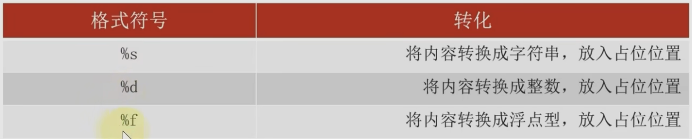

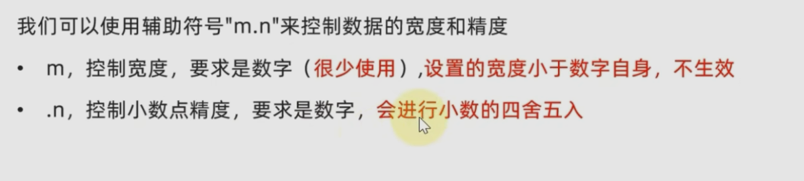

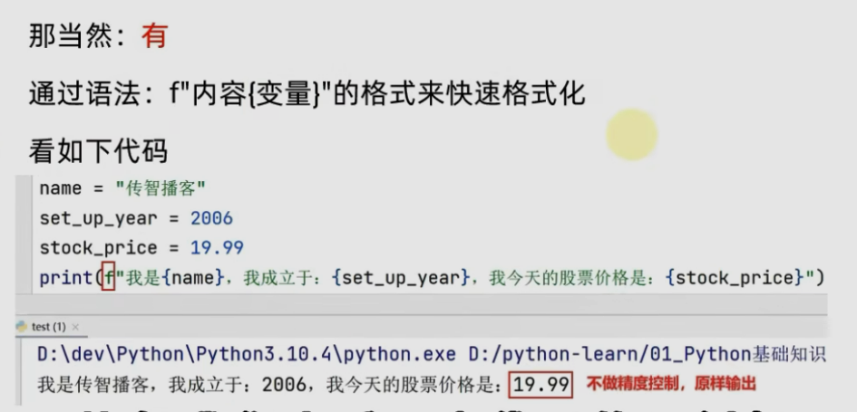

```python
name = "aimee"
year = 2006
price = 19.99

print(f"my is {name}, age is {year}, prince is {price}")
message = f"my is {name}, age is {year}, prince is {price}"
print(message)
```

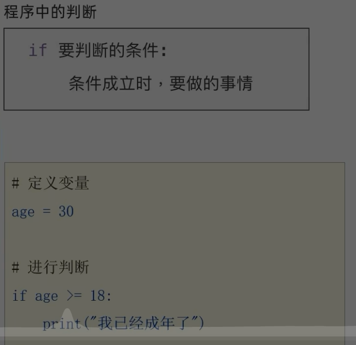

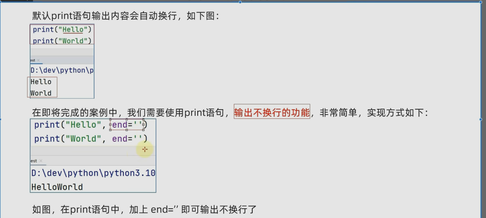

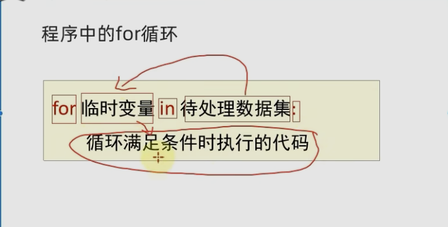

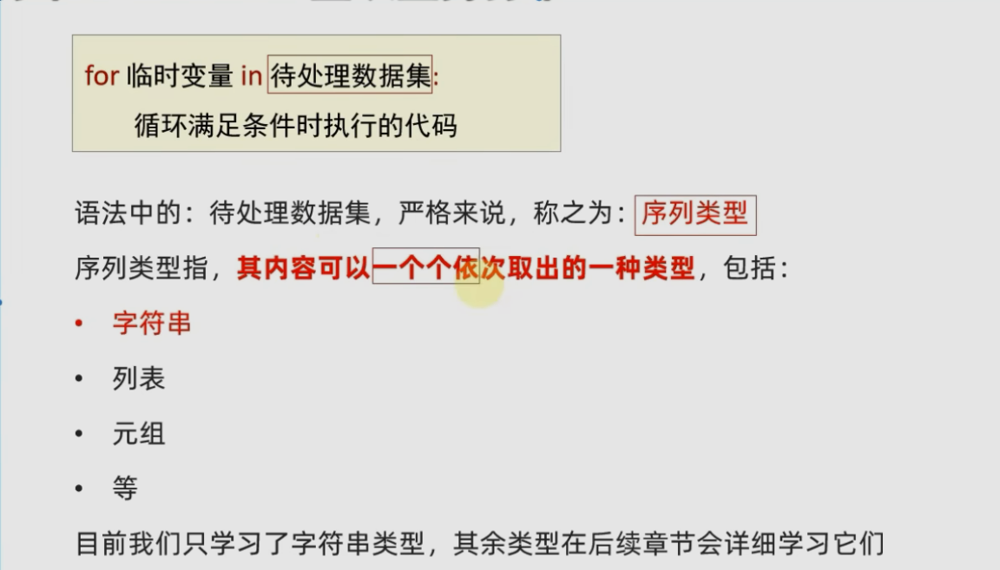

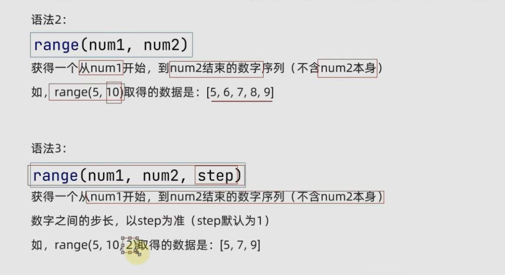

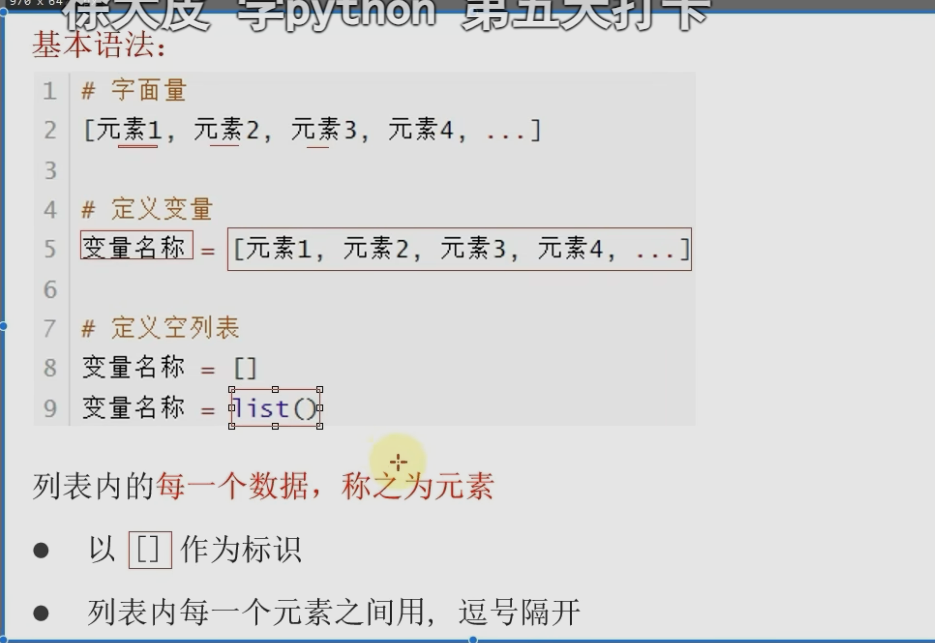

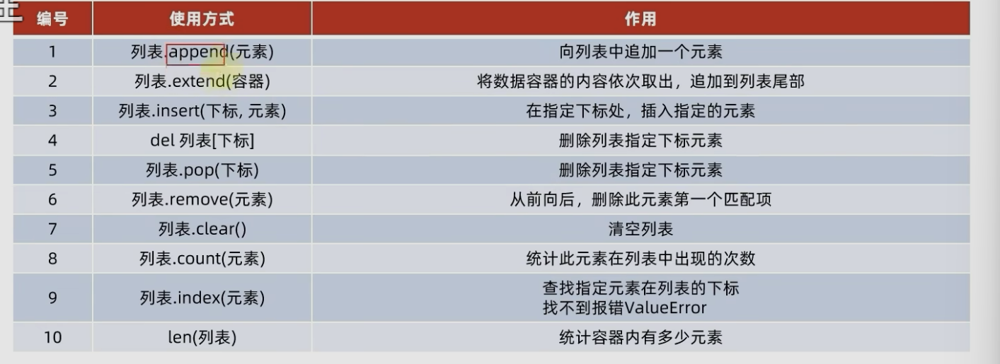

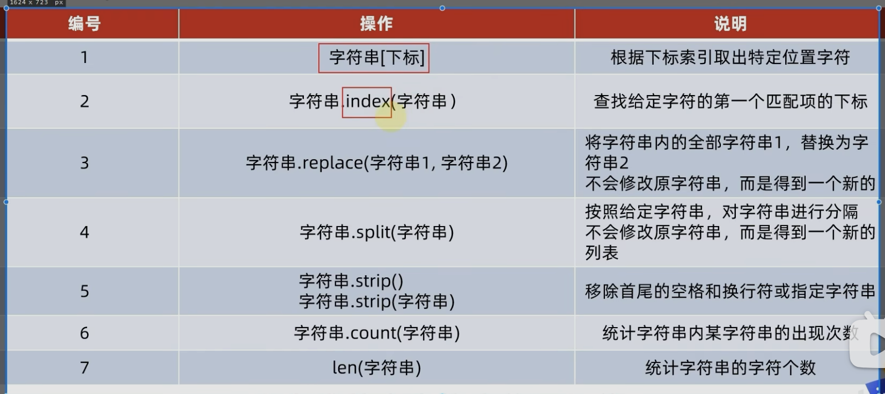